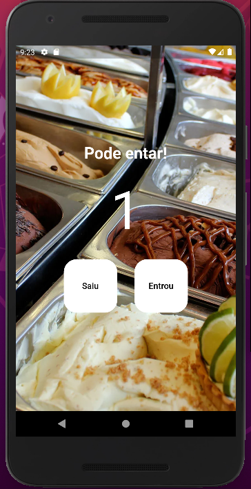

<h1 align="center">Contador_de_pessoas</h1>

<h1 align="center">
  
</h1>

# Topicos
- Descrição do projeto
- Tecnologias usadas

## Descrição do projeto

Projeto de um contador de pessoas, este projeto tem como objetivo auxiliar
na indentificaçao da quantidade de pessoas em determinado ambiente.

Aqui alguns recursos para voçê começar, caso esse seja seu primeiro projeto
Flutter.
- [Lab: Write your first Flutter app](https://docs.flutter.dev/get-started/codelab)
- [Cookbook: Useful Flutter samples](https://docs.flutter.dev/cookbook)

